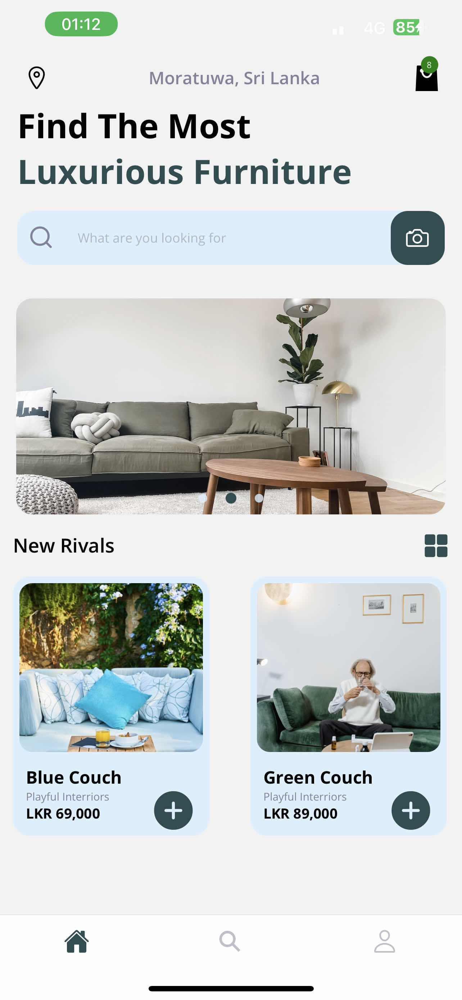
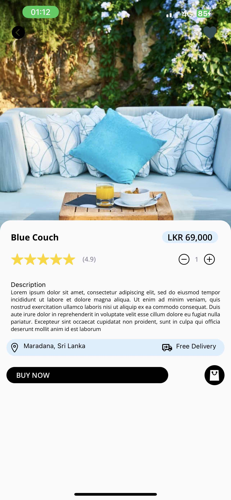
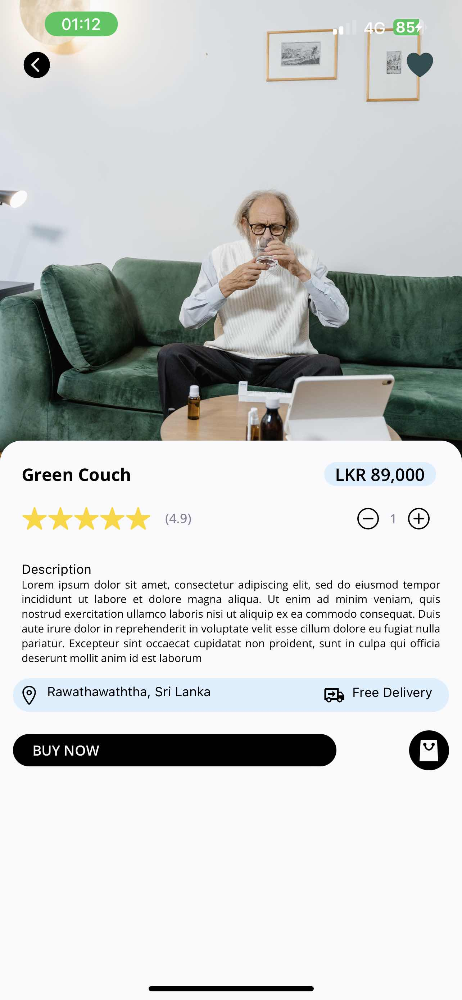
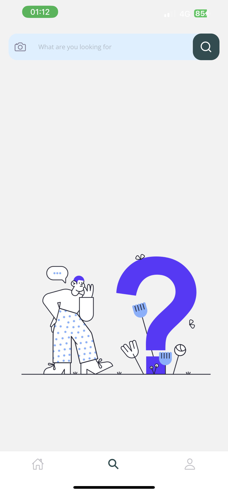
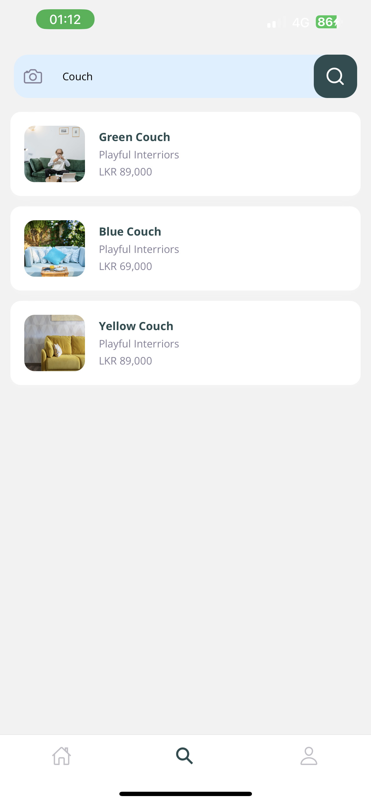

<a name="readme-top"></a>

<!-- ABOUT THE PROJECT -->

## About The Project

### React-Native E-commerce App using REST-API Integration
How It works:
- Home Page



- Product Details Page



- Search Page



<p align="right">(<a href="#readme-top">back to top</a>)</p>

### Built With

Here this E-commerce Application application create using React-native Framework and REST_API using for data fetch from MONGO DB.

- [![react-document][React Native]][react-document]
- ![REST API][REST API]

<p align="right">(<a href="#readme-top">back to top</a>)</p>

<!-- GETTING STARTED -->

## Getting Started

### Prerequisites

Install Expo CLI:
* Run the following command to install Expo CLI globally:

- Using npm:
  ```sh
  npm install -g expo-cli
  ```
- Using yarn:
  ```sh
  yarn global add expo-cli
  ```

Verify Installation:
- After the installation is complete, you can verify it by checking the installed version:
  ```sh
  expo --version
  ````

### Installation

_This is the step you have to follow._

1. Clone the repositery
    ```sh
    git clone https://github.com/Yesh-adithya31/furniture-app.git
    ````

2. Install npm packages
   ```sh
   npm install
   ```
3. Run cloned project

- Using npm:
   ```sh
   npx expo start
   ```
- Using yarn:
   ```sh
   yarn expo start
   ```

<p align="right">(<a href="#readme-top">back to top</a>)</p>

<!-- MARKDOWN LINKS & IMAGES -->

[react-document]: https://facebook.github.io/react-native/
[React Native]: https://img.shields.io/badge/React_Native-61DAFB?style=for-the-badge&logo=react&logoColor=white
[REST API]: https://img.shields.io/badge/REST_API-Your_Color?style=for-the-badge

